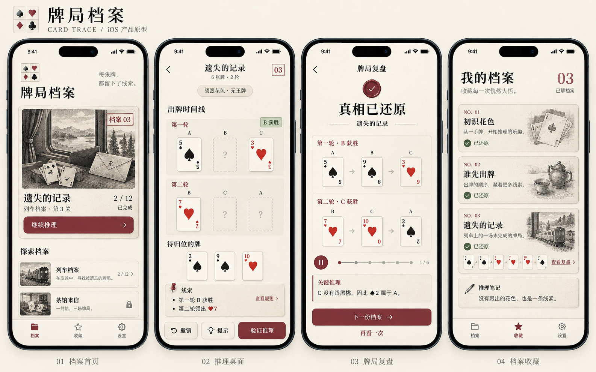

# 牌局档案 · 原型与交互说明

版本：1.0 · 日期：2026-09-24 · 原型状态：静态高保真概念图，尚未实现为可交互应用

## 1. 原型图

原图尺寸：1586 × 992 像素。由内置 image_gen 生成，本次以原始像素复制归档，没有裁切、放大或重新生成。

图中包含档案首页、推理桌面、牌局复盘、档案收藏四个页面。图内 iPhone 外框、状态栏、Dynamic Island、时间等只用于展示，不应作为应用素材绘制。正式界面适配 iOS 14.0 及以上系统的安全区域和实际设备。

## 2. 当前约束与原型解释

- 首版全部内容免费，不设购买、订阅、充值、付费提示、付费章节或广告换提示。
- 原型首页的章节锁表示**完成前章后解锁**；实现时应补充文字说明这一条件。通关进度是唯一的章节访问条件。
- 首页“2 / 12”与收藏页“03”代表完成第 3 关前后的两个状态，并非同一时刻的矛盾数据。
- “列车档案 12 关”是首章示意；首版 40 关为总体内容目标，最终章节数量与分配在 8 关原型验证后确定。
- 图像中的纹理、插画、文字大小及卡面细节是视觉参考；真实文字、按钮、花色和牌面数值必须由原生控件准确呈现。

## 3. 页面职责

| 页面 | 内容与行为 | 必须考虑的状态 |
|---|---|---|
| 档案首页 | 继续当前关卡、章节列表、章节进度、底部导航 | 首次进入、存在未完成关卡、章节可进入、前章未完成 |
| 推理桌面 | 规则入口、线索、出牌时间线、待归位牌、撤销、提示、验证 | 空位、选中、拖动、合法落点、已固定牌、信息不足、已证明矛盾 |
| 牌局复盘 | 还原结果、逐手播放、暂停、定位到某手、关键推理、下一关 | 已通过、暂停、播放中、播放结束；失败假设使用独立的反馈状态 |
| 档案收藏 | 已完成关卡、故事内容、复盘入口、个人推理笔记 | 尚无完成关卡、已还原列表、无笔记、有笔记 |

首页与收藏页使用统一的“档案 / 收藏 / 设置”底部导航；推理与复盘页隐藏全局导航，保留返回入口。离开推理页先保存当前假设，返回后可继续。

## 4. 六张牌示例的显示约束

全部牌为黑桃 2、5、9 与红桃 3、7、10；A、B、C 各持两张，座次按 A → B → C 循环。必须跟领出花色；无该花色才可出其他牌；无王牌。领出花色点数最大者赢，并领出下一轮。

**未解页面：**

- 第一轮依次为 A：♠5、B：空位、C：♥3；已知 B 获胜。
- 第二轮的领出者据线索确定为 B，显示顺序 B、C、A；B：♥7、C：空位、A：空位。
- 待归位牌只有 ♠2、♠9、♥10。已固定的 ♠5、♥3、♥7 不得再次出现在牌池里。
- 点击“验证推理”才触发提交检查；不能以逐格红绿对答案的方式泄露解答。

**已解复盘：**

| 轮次 | 出牌顺序 | 赢家 |
|---|---|---|
| 第一轮 | A：♠5 → B：♠9 → C：♥3 | B |
| 第二轮 | B：♥7 → C：♥10 → A：♠2 | C |

关键解释：“C 第一轮没有跟黑桃，说明当时手中没有黑桃，因此剩下的 ♠2 属于 A。”正式文案需明确“必须跟花色”这一前提。

一般关卡中，只有规则与公开线索足以确定领出者时，才将下一轮顺序显示为已知。不得提前把隐藏答案中的赢家或顺序渲染出来。

## 5. 操作约定

1. **放牌**：支持拖动到空位，也支持点选牌后点选目标空位。已固定的公开牌不可移动。
2. **移回与换牌**：玩家自行放置的牌可移回牌池。放入已有玩家牌的位置时交换两张牌；若从牌池拖入，原位置上的牌回到牌池。目标为固定公开牌时拒绝操作，由游戏状态统一处理。
3. **撤销**：撤销一次完整操作，恢复牌的位置与相关状态；跨越验证结果时同步清理过时反馈。提示阅读记录独立保存。首版不另设重做入口。
4. **验证**：未填完时提示“还有牌未归位”或指出当前已可证明的矛盾；完整合法且满足所有公开条件时通关。
5. **提示**：依次提供关注方向、关键关系、具体推导。提示免费，由玩家主动请求，不惩罚连续尝试。
6. **回放**：播放进度与规则事件绑定，切后台暂停；恢复前台后由用户继续播放，避免错过关键解释。
7. **章节解锁**：根据关卡完成条件更新；锁定项显示“完成前章解锁”，不进入支付流程。

## 6. 视觉基线

| 项目 | 建议 |
|---|---|
| 背景 | 暖白 `#F6F2E8`，纸纹保持轻微，不影响对比 |
| 正文 | 深墨 `#252B27`，系统字体，支持动态字体 |
| 强调与主按钮 | 酒红 `#833D46`，主要用于确认、批注及关键证据 |
| 已验证状态 | 低饱和绿色，同时搭配文字或图标 |
| 标题 | 少量宋体风格大标题，正文与控制使用清晰无衬线字体 |
| 插画 | 列车、档案夹、信封等章节主题插画，采用一致的黑白线描风格 |
| 牌面 | 原生文字与形状绘制，牌 ID、点数和花色由数据驱动 |

颜色是建议设计值，需在真机上核实对比度。黑桃与红桃不仅通过颜色区分，还应有不同形状及可读标签。

## 7. 适配与验收

- 最低支持 iOS 14.0；以小屏、刘海屏及更新机型分别检查安全区域、返回按钮和底部操作区。
- 内容不足以一屏容纳时允许纵向滚动，主要操作区保持可达；不为复刻图片而缩小文字与点击区域。
- 常用点击目标按至少 44 × 44 pt 设计，牌池提供点选替代拖拽。
- VoiceOver 朗读“黑桃 9，未放置”或“第一轮 B，空位”等含义；不单独朗读装饰纹理。
- 尊重减少动态效果设置；动画中断、拖动取消、旋转事件或切后台不会改变牌的真实状态。
- 以数据准确性为先：牌不重复、牌序正确、赢家正确、进度一致。

## 8. 素材和实现边界

原型 PNG 可用于评审和设计对照，不能整张作为页面背景后叠加按钮。正式实现应拆分为插画、纹理、原生文字、原生按钮、卡牌组件和可交互时间线。原型图片中的微小文字或卡面装饰若有生成偏差，以产品规则、关卡数据和本文说明为准。
